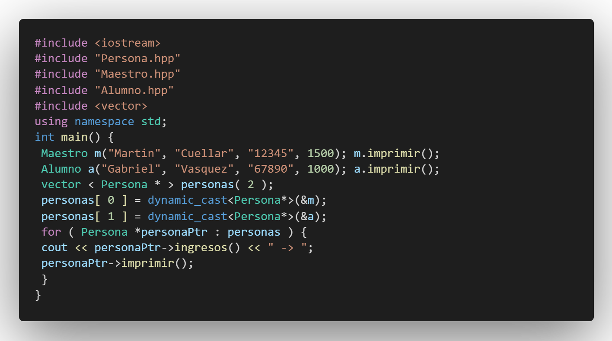
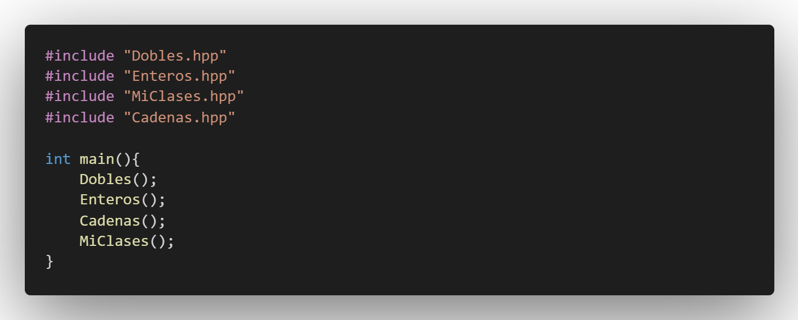

# Herencia y Polimorfismo

## :copyright: Autor

- :camera: 

- :joy: **Jamil André García Meléndez**
- :e-mail: garciajamil69@gmail.com
- :link: https://github.com/JamilGarcia/C-_PDC7
- :calendar: 2020-08-30 19:12

---

## :dart: Objetivos

---

## :black_circle: Herencia: Alumno

---

## :triangular_ruler: Herencia: Herencia

---

## :white_large_square: Herencia: Maestro

## :white_medium_square: Herencia: Persona

---

## :large_blue_diamond: Polimorfismo: Alumno

## :small_blue_diamond: Polimorfismo: Maestro

---

## :large_orange_diamond: Polimorfismo: Persona

---
## :large_orange_diamond: Polimorfismo: Polimorfismo

---
## :large_orange_diamond: Templates: Cadenas

---
## :large_orange_diamond: Templates: Dobles

---
## :large_orange_diamond: Templates: Enteros

---
## :large_orange_diamond: Templates: MiClase

---
## :large_orange_diamond: Templates: Pila

---
## :large_orange_diamond: Templates: Templates

---
## :large_orange_diamond: Templates: Tipos

---
#### Herramientas:
- :package: [Visual Studio Code](https://code.visualstudio.com/)
- :camera: [Polacode-2020 v0.5.2](https://github.com/jeff-hykin/polacode)
- :notebook: [Markdown Cheatsheet](https://github.com/adam-p/markdown-here/wiki/Markdown-Cheatsheet)
- :smile: [Emoji Cheat Sheet](https://www.webfx.com/tools/emoji-cheat-sheet/)